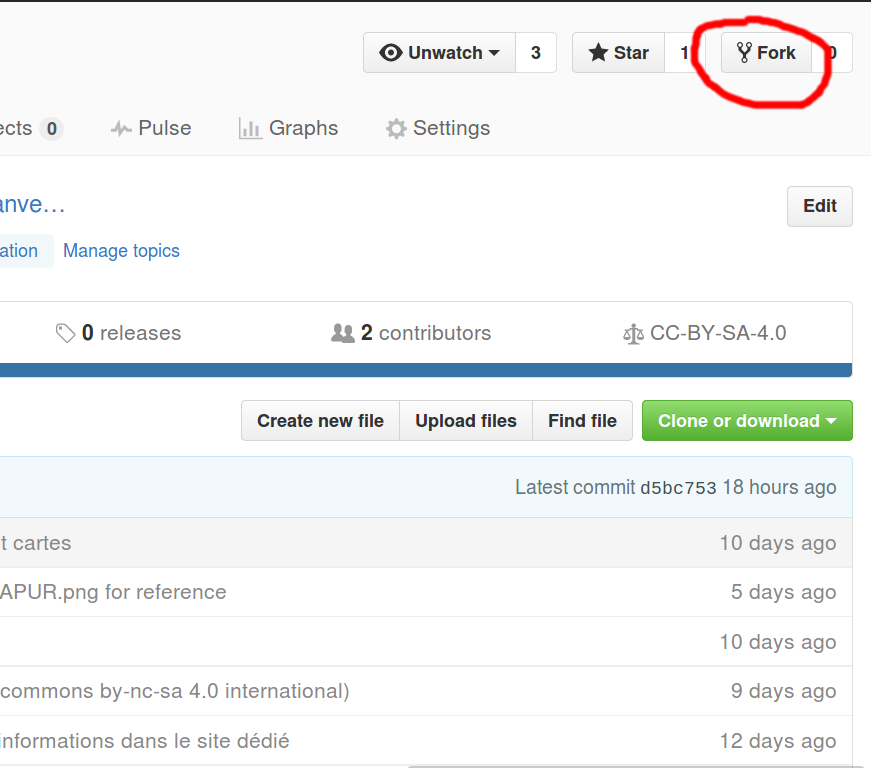
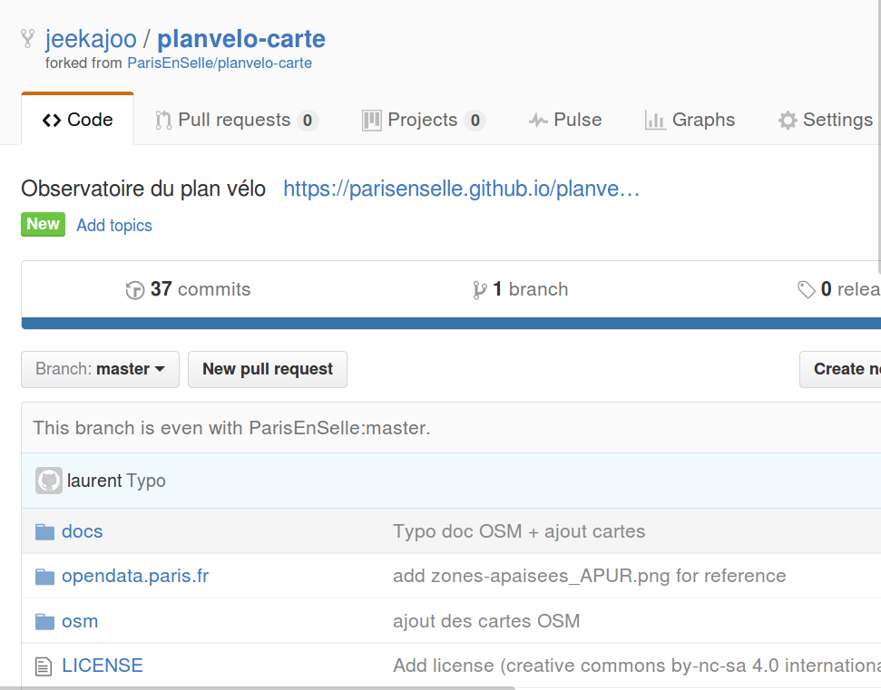
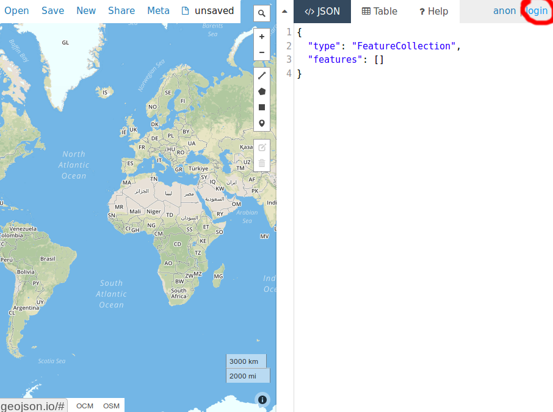
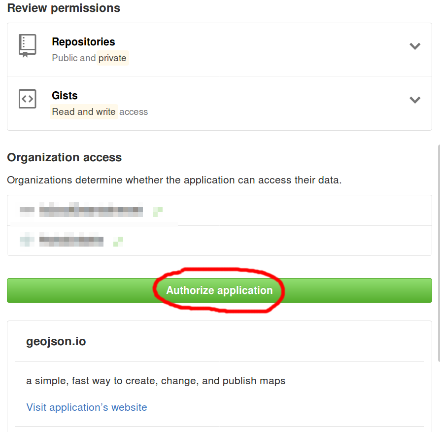
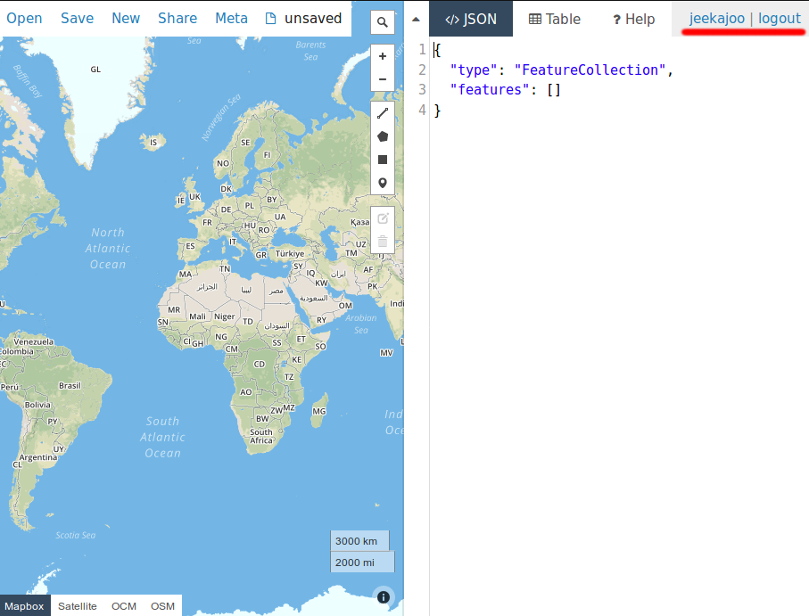
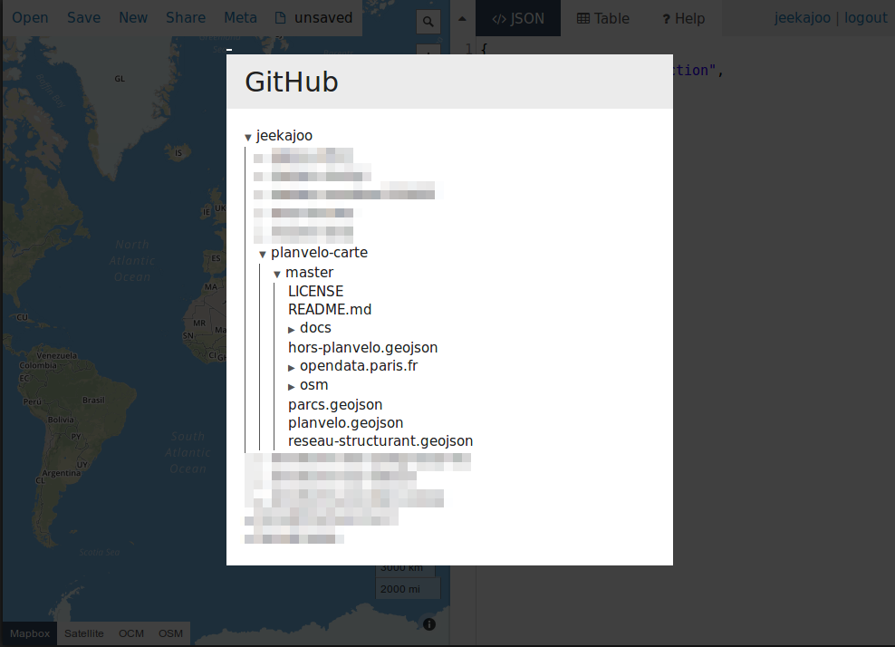
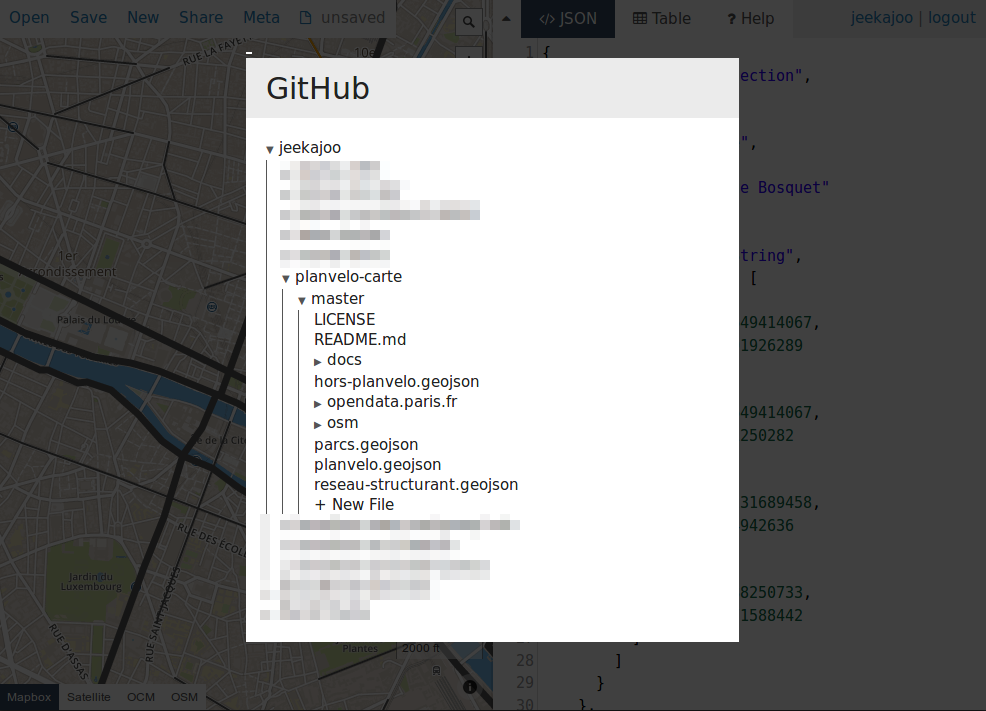
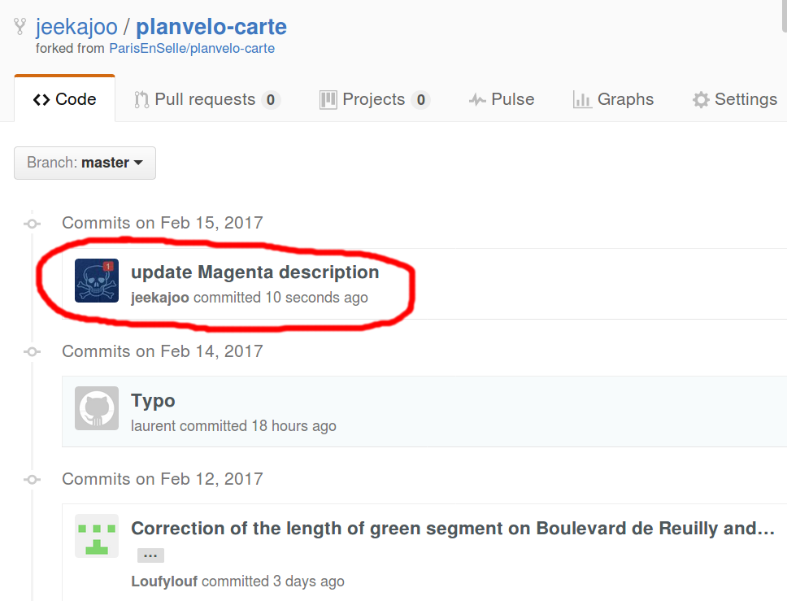

# Contribuer au projet

<!-- TOC depthFrom:1 depthTo:6 withLinks:1 updateOnSave:1 orderedList:0 -->

- [Contribuer au projet](#contribuer-au-projet)
	- [Prérequis](#prrequis)
	- [Visiteurs - Pull requests](#visiteurs-pull-requests)
	- [Membres Paris en Selle](#membres-paris-en-selle)

<!-- /TOC -->

## Prérequis

* Disposer d'un compte [Github](https://github.com).

## Visiteurs - Pull requests

Voici une documentation pour les non-initiés à `Git`.

* Forker le projet

* Résultat:

* Se rendre sur l'éditeur de carte [geojson.io](http://geojson.io).

* Se connecter avec le lien "login" en haut à droite. 

* Pour la première connexion, vous devrez autoriser l'éditeur à accèder à vos données Github. Cliquer sur "Authorize application". 

* Une fois connecté, vous devriez avoir un écran similaire à celui-ci.

* Ouvrir la carte à éditer dans l'éditeur de carte [geojson.io](http://geojson.io). Open > Github > `la-carte-à-éditer.geojson`.

* Faire la modifications

* Enregistrer la carte. Save > Github > `la-carte-à-éditer.geojson` à écraser

* Taper un message décrivant la modification réalisée et valider. 

* Vérification de l'enregistrement: afficher la liste des commits de votre fork

## Membres Paris en Selle

* Demander un accès en écriture sur ce projet aux personnes concernées.

* Se rendre sur l'éditeur de carte [geojson.io](http://geojson.io).

* Se connecter avec le lien "login" en haut à droite. 

* Pour la première connexion, vous devrez autoriser l'éditeur à accèder à vos données Github. Cliquer sur "Authorize application". 

* Une fois connecté, vous devriez avoir un écran similaire à celui-ci.

* Ouvrir la carte. Menu "Open > Github". Dans l'arborescence, cliquer sur `la-carte-à-éditer.geojson` 

* Une fois les modifications effectuées, ouvrir le menu "Save > Github". Sélectionner le fichier à écraser (`la-carte-à-éditer.geojson`). 

* Taper un message décrivant la modification réalisée et valider. 

* Vous pouvez enfin vérifier que votre travail a été enregistré [en affichant la liste des commits](https://github.com/ParisEnSelle/planvelo-carte/commits/master). 
